# Speed camera detection app prototype for Lithuania roads
## Installation Tutorial
1. **Install Python**
    - Install the Python programming language, version no older than 3.7.
    - Link: [Python](https://www.python.org/)
2. **Install Integrated Development Environment (IDE)**
    - Preferably install PyCharm.
    - Link: [PyCharm](https://www.jetbrains.com/pycharm/)
3. **Install Required Libraries**
    - Install the necessary libraries for this project from the "requirements.txt" file.
    - In the IDE terminal, type: `pip install -r requirements.txt`
4. **Install Library for Graphics Card**
    - For working with the graphics card, enter the following command in the terminal:
    - `pip3 install torch torchvision torchaudio --index-url https://download.pytorch.org/whl/cu118`
5. **Launch the Project**
    - The project is launched from the "main/py/main.py" file.
## User's Guide

### Welcome

    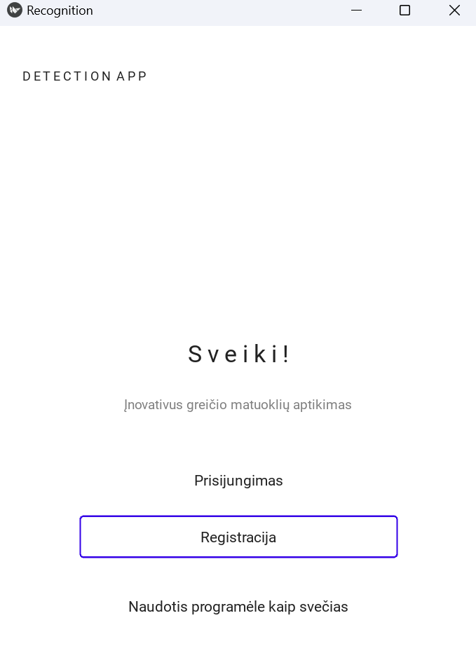

###
- Upon launching the system, the user is presented with two options: login and registration.
- Below them, there is a "Use the app as a guest" button, which allows users who do not wish to provide their data to use the speed camera detection feature.

## Login

    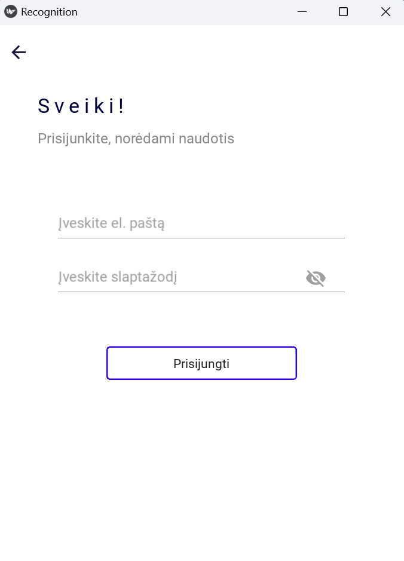

###
- The user can return to the home screen by pressing the arrow in the top right corner.
- A user with an account enters their login details: email and password.
- The password is hidden, but displayed when the "eye" icon is pressed.
- They press the "Login" button.
- If the credentials are entered correctly and the user exists, the login is successful; otherwise, appropriate error messages are displayed.

## Signup

    

###
- The user can return to the home screen by pressing the arrow in the top right corner.
- A user without an account enters personal information: first name, last name, email, and password.
- The password is hidden but displayed when the "eye" icon is pressed.
- They press the "Register" button.
- If the data is entered correctly, the user is registered.

## Camera

    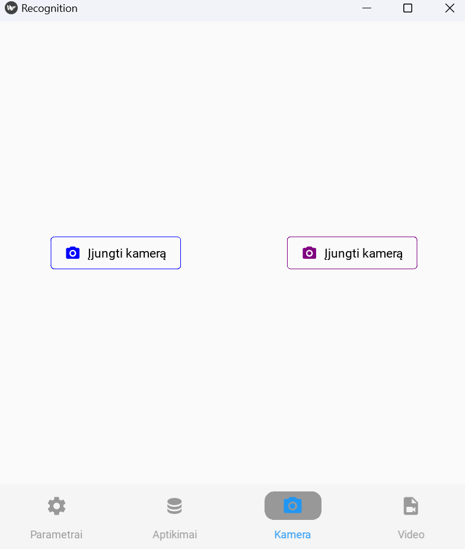

###
- In the "Camera" window, speed cameras are detected with the help of a smart device.
 - The left button "Turn on camera" activates the camera, along with the object detection model on the server.
- The right button "Turn on camera" activates the camera, along with the object detection model on the computer (locally).
- Once the camera is activated, the buttons are hidden, and the view from the device's camera is displayed, along with the already functioning speed camera detection.
- P.S. How images are detected from the server will be demonstrated during the defense, as it is very costly to keep it turned on.

## Detected Speed Cameras

    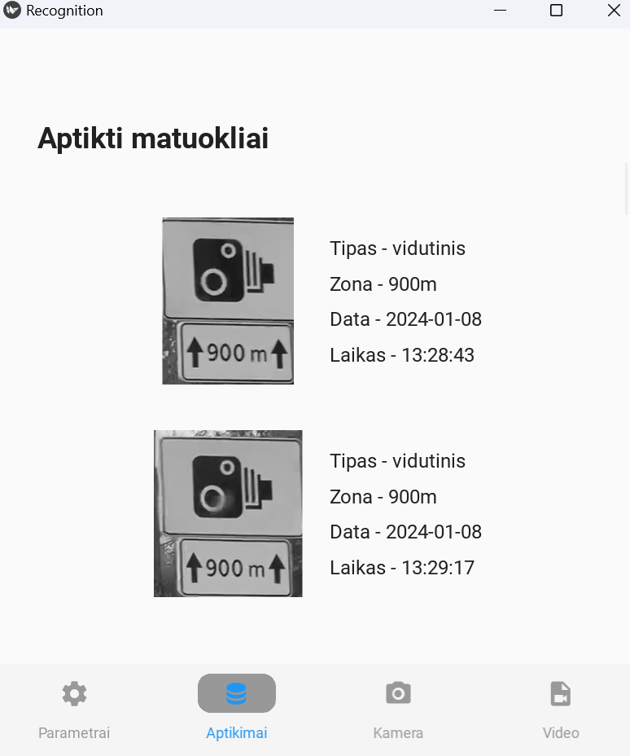

###
- Pressing the "Detections" button in the bottom navigation displays a list of detected speed cameras and other information about them.

## Settings

    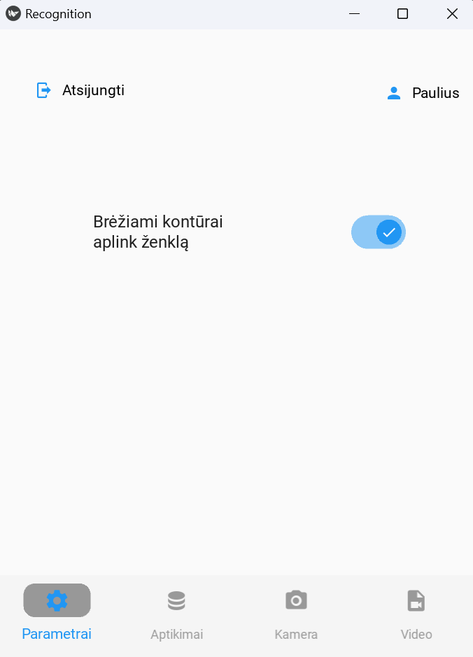

###
- Pressing the "Settings" button in the navigation opens a window with a "Draw contours around the sign" button, a "Log out" button, and a "Paulius" account edit button showing the user's name.

## Account management

    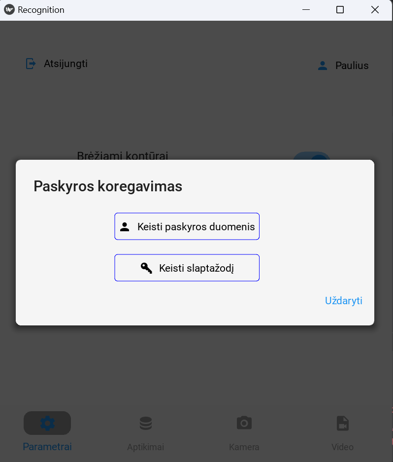

 
###
• Pressing the account button brings up the "Account Editing" window with the option to modify account details or change the password.

## Account data

    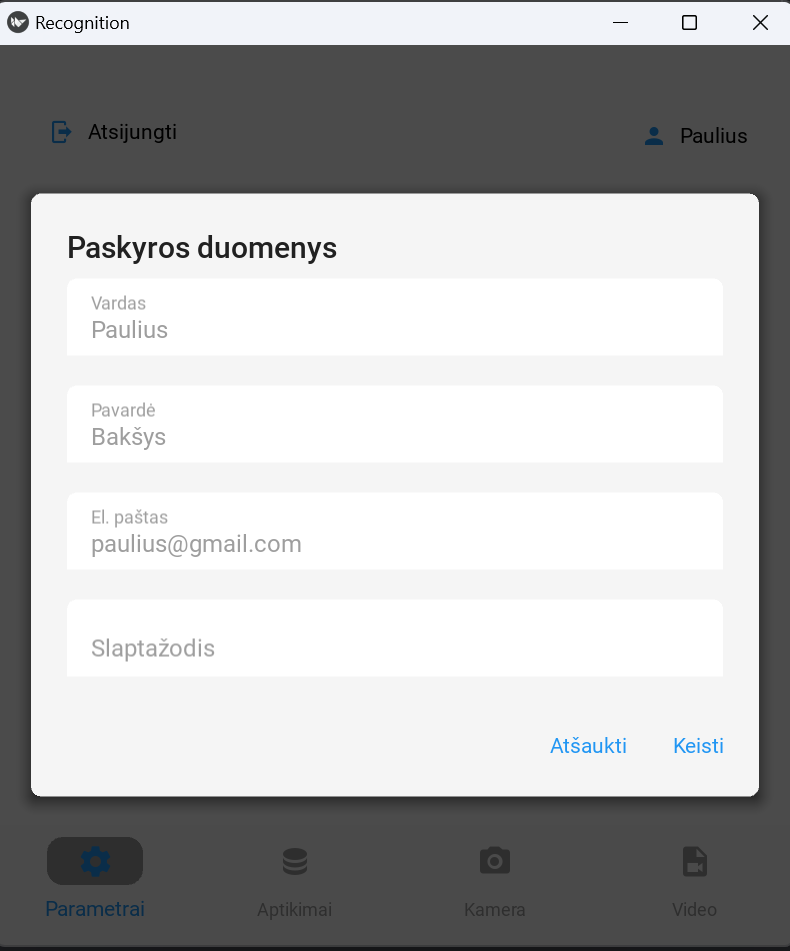

###
- Pressing the "Change Account Data" button opens the "Account Details" window, which displays the current user data.
- To modify them, the correct password must be entered and if the field validations are appropriate, pressing the "Change" button will update the data.

## Password change

    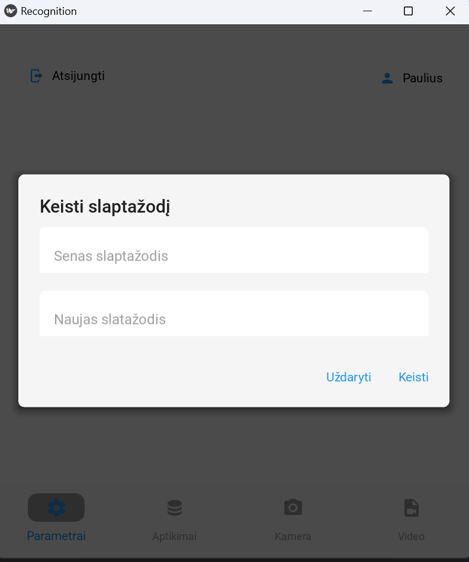

###
- Pressing the "Change Password" button opens a window with a password change form.
- Upon entering the correct current password and a new password that meets the validation criteria, pressing the "Change" button will update the password to the new one.

## Video

    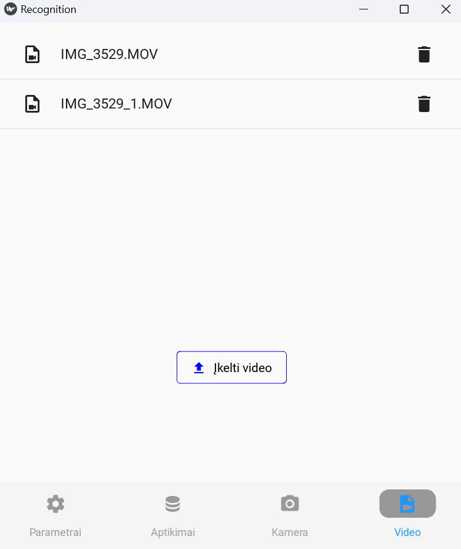

###
- An additional feature has been added that allows for the detection of speed camera signs and alerts from video recordings.
- The user presses on the desired video recording to play it.
- Users can add and remove video recordings.

## Speed camera detection

    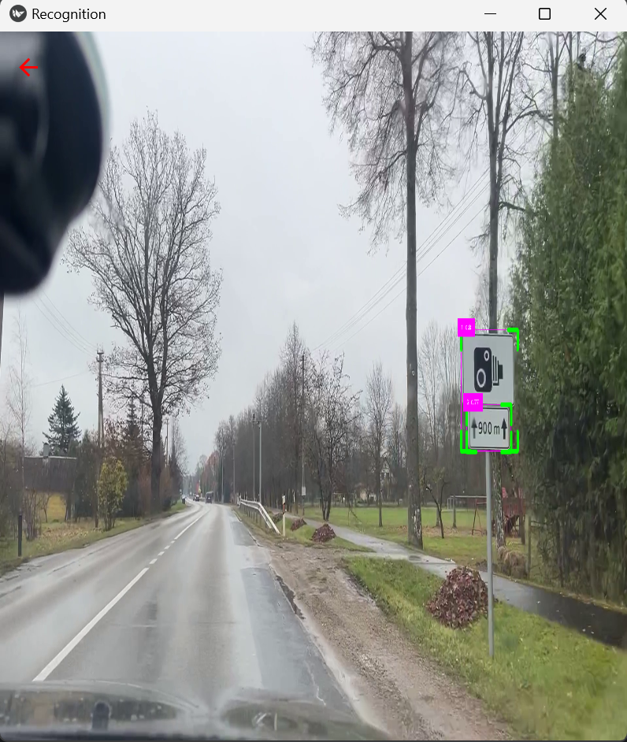

###
- The speed sign recognition window from the video recording is displayed. The camera window looks exactly the same, but it includes a bottom navigation menu.
- Contours are drawn around the detected sign, based on the coordinates received from the object detection model.

## Alert message

    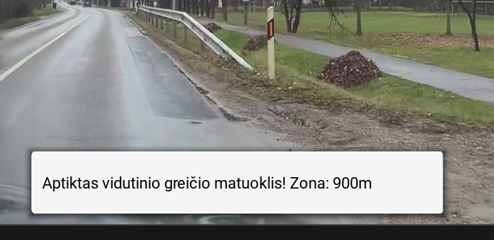

###
- This is how the visual notification appears to the user upon recognizing an average speed camera sign, which informs about an average speed camera installed on the current section of the road.
